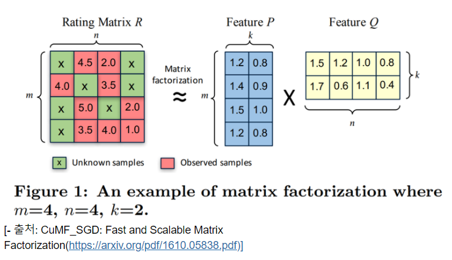
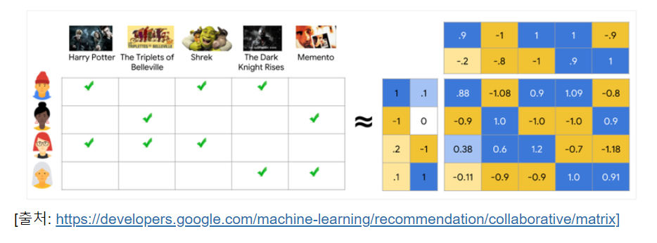

오늘은 아이펠 Exploration 노드 14번을 공부하고 공부한 내용을 포스팅해보았습니다. 

전체 코드는 깃허브를 참고하시고, 여기서는 중요한 메소드만을 작성하였습니다.

------

###### 출처

- AIFFEL LMS 

  문제시 연락 부탁드립니다. :)


---

목차

- 추천 시스템이란?
- 데이터 탐색과 전처리
- 사용자의 명시적 / 암묵적 평가
- Matrix Factorization ( MF )
- CSR (Compressed Sparse Row) Matrix
- MF 모델 학습하기
- 비슷한 아티스트 찾기 + 유저에게 추천하기


----


# 1. 추천시스템이란?

추천 시스템은 사용자가 선호할 만한 아이템을 추측함으로써 여러 가지 항목 중 사용자에게 적합 한 특정 항목을 선택(information filtering)하여 제공하는 시스템입니다.


- 고전적 추천 시스템

  - 협업 필터링

    - 대규모의 기존 사용자 행동 정보를 분석하여 해당 사용자와 비슷한 성향의 사용자들이 기존에 좋아했던 항목을 추천하는 기술

    - 행렬분해(Matrix Factorization), k-최근접 이웃 알고리즘 (k-Nearest Neighbor algorithm; kNN) 등의 방법이 많이 사용

    - 협업 필터링을 위해서는 반드시 기존 자료를 활용 BUT 이러한 자료들을 사용자에게 직접 요구해야만 하는것은 아님

    - 단점

      - Cold Start

        협업 필터링은 기존의 자료가 필요한바, 기존에 없던 새로운 항목이 추가되는 경우는 추천이 곤란해지는 현상

      - 사용자 수가 많은 경우 효율 적으로 추천할 수 없음

        계산이 몇 시간에서 며칠까지 걸리는 경우가 종종 생김

      - Long tail

        시스템 항목이 많다 하더라도 사용자들은 소수의 인기 있는 항목에만 관심을 보이기 마련이다. 따라서 사용자들의 관심이 적은 다수의 항목은 추천 을 위한 충분한 정보를 제공하지 못하는 경우

  - 콘텐츠 기반 필터링

    - 항목 자체를 분석하여 추천을 구현
    -  항목을 분석한 프로파일(item profile)과 사용자의 선호도를 추출한 프로파일(user profile)을 추출하여 이의 유사성을 계산
    - 아이템 분석 알고리즘이 핵심적
      - 군집분석(Clustering analysis), 인공신경망(Artificial neural network), tf-idf(term frequencyinverse document frequency) 등의 기술이 사용
    - 로 협업 필터링에서 발생하는 콜드 스타트 문제 를 자연스럽게 해결
    - 단점
      - 만 다양한 형식의 항목을 추천하기 어려움

- 모델 기반 협력 필터링

  - 기존 항목 간 유사성을 단순하게 비교하는 것에서 벗어나 자료 안에 내재한 패턴 을 이용하는 기법

    - 자료의 크기를 동적으로 변화시키는 방법

      영 화를 추천하는 경우, ‘해리 포터’ 시리즈 2편을 추천하기 위해서는 ‘해리 포터’ 시리즈 1편, 단 한 편을 좋아했는가가 다른 무엇보다 중요한 요소

    - 추천을 위한 자료의 크기를 변화시키는 방법

    - 잠재(latent) 모델에 기반을 둔 방법

      잠재 모델이란 사용자가 특정 항목을 선호 하는 이유를 알고리즘적으로 알아내는 기법

  - LDA(Latent Dirichlet Allocation), 베이지안 네트워크 (Bayesian Network) 등의 알고리즘이 사용

  

- 출처 : [콘텐츠 추천 알고리즘의 진화](http://www.kocca.kr/insight/vol05/vol05_04.pdf)


# 2. 데이터 탐색과 전처리


- TSV 파일이란?
  -  tsv는 Tab-Separated Values의 약자로서,  구분자가 tab('\t') 문자
- CSV 파일이란?
  - csv는 Comma-Separated Values의 약자로서, 구분자가 comma(',') 문자


- tsv 파일 읽어오기

  ```python
  data = pd.read_csv(fname, sep='\t', names= col_names)      # sep='\t'로 주어야 tsv를 열 수 있습니다.  
  ```


- pandas에서 사용할 컬럼만 남기기

  ```python
  using_cols = ['user_id', 'artist', 'play']
  data = data[using_cols]
  ```

  

- pandas Dataframe에서 유니크한 데이터 개수알아보기

  ```python
  data['user_id'].nunique()
  ```

  

- pandas Dataframe에서 group by 사용하기

  ```python
  user_median = data.groupby('user_id')['play'].median()
  
  ```


- 꼭 암기

  ```python
  # 아티스트 이름은 꼭 데이터셋에 있는 것과 동일하게 맞춰주세요. 
  my_favorite = ['black eyed peas' , 'maroon5' ,'jason mraz' ,'coldplay' ,'beyoncé']
  
  # 'hwi'이라는 user_id가 위 아티스트의 노래를 30회씩 들었다고 가정하겠습니다.
  my_playlist = pd.DataFrame({'user_id': ['hwi']*5, 'artist': my_favorite, 'play':[30]*5})
  
  if not data.isin({'user_id':['zimin']})['user_id'].any():  # user_id에 'zimin'이라는 데이터가 없다면
      data = data.append(my_playlist)                           # 위에 임의로 만든 my_favorite 데이터를 추가해 줍니다. 
  ```

  - `data = data.append(my_palylist)`로 하면 index 순서대로가 아닌 0 ,1, 2, 3, 4, .... , 56643,56644, 0,1,2,3,4 순으로 들어오게 됩니다.

    - 인덱스 순서대로 넣게해주려면 `data = data.append(my_playlist, ignore_index=True) ` 처럼 `ignore_index=True`옵션을 넣어주면 됩니다.

    - https://yganalyst.github.io/data_handling/Pd_2/에서의 inplace와 drop은 안됨.

    

# 3. 사용자의 명시적 / 암묵적 평가

- 명시적 평가 : 좋아요나 별점과 같은 사용자가 직접적으로 드러낸 데이터

- 암묵적 평가 : 어떤 곡을 몇번 플레이했다 / 어떤 영화를 몇번 봤다와 같은 서비스를 이용하면서 자연스럽게 발생하는 암묵적(Implicit) 피드백

  - 암묵적 데이터를 사용할때 참고하면 좋을 논문 : [Collaborative Filtering for Implicit Feedback Datasets](http://yifanhu.net/PUB/cf.pdf)
  - 특징
    - 부정적인 피드백이 없다.(No Negative Feedback)
    - 애초에 잡음이 많다.(Inherently Noisy)
    - 수치는 신뢰도를 의미한다.(The numerical value of implicit feedback indicates confidence)
    - Implicit-feedback Recommender System의 평가는 적절한 방법을 고민해봐야 한다.(Evaluation of implicit-feedback recommender requires appropriate measures)

  

해당 프로젝트에서는 암묵적 데이터의 해석에 대한 규칙을 다음과 같이 정했습니다.

- 한번이라도 들었으면 선호라고 판단
- 많이 재생한 아티스트에 대해 가중치를 주어서 확실히 좋아한다고 판단한다.


# 4. Matrix Factorization ( MF )

해당 프로젝트에서는 m명의 사용자들이 n명의 아티스트에 대해 평가한 데이터를 포함한 (m*n) 사이즈의 평가 행렬(Rating Matrix)을 만들었습니다.

행렬에는 그림과 같이 결측치가 존재하며, 추천시스템의 협업 필터링이란 이 평가행렬을 전제로합니다. 


추천시스템의 모델은 Matrix Factorization(MF, 행렬 분해) 모델을 사용하였습니다. 기본아이디어는 `(m*n)` 사이즈의 행렬 R을 `(m*k)` 사이즈의 행렬 P와 `(k*n)`사이즈의 행렬 Q로 분해한다면 R이란 P와 Q의 행렬곱으로 표현할수 있다는 것입니다. 아이디어는 단순하지만, k는 m이나 n보다 훨씬 작은 값이므로, 계산량 측면에서 매우 유리하고 MF모델의 성능이 준수하고 Scalability가 좋아서 많이 사용됩니다.



실제 영화 추천 시스템에 예를들어 보자면 다음과 같습니다.



MF 모델의 목표는 모든 유저와 아이템들에 대해서 K-Dimension 벡터를 벡터를 잘 만드는 것입니다. 벡터를 잘 만드는 기준은 유저 i의 벡터 U_i와 아이템 백터 j의 벡터 I_j를 내적했을 때 유저 i가 아이템 j에 대해 평가한 수치 M_ij와 비슷한지 입니다.


MF에도 다양한 변형이 있으며, 해당 프로젝트에서 사용할 모델은 [여기 논문](http://yifanhu.net/PUB/cf.pdf)에서 제안한 모델입니다.


# 5. CSR (Compressed Sparse Row) Matrix

실제로 평가행렬을 만든다고 생각해 보면, 유저수도 수백명에 아티스트는 29만명이 넘습니다. 평가행렬의 값이 1Byte를 가진다고해도 실제 유저수와 아티스트의 곱인 평가행렬의 크기는 엄청날 것이며, 대부분 0으로 채워질 것입니다.

이 평가행렬의 전부를 메로이에 올려놓고 작업한다는 것은 불가능하며, 그 대안으로 사용되는 것이 CSR Matrix입니다.


CSR Matrix는 Sparse한 matrix에서 0이 아닌 유효한 데이터로만 채우는 Matrix입니다.


# 6. MF 모델 학습하기


# 7. 비슷한 아티스트 찾기 + 유저에게 추천하기