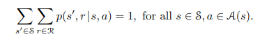
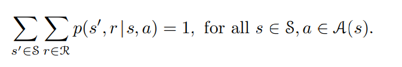

오늘은 강화학습 분야에서 Finite Markov Decision Processes에 대하여 공부한 것을 정리해 보았습니다.

---

###### 참고사이트

- https://towardsdatascience.com/introduction-to-reinforcement-learning-rl-part-3-finite-markov-decision-processes-51e1f8d3ddb7

----

###### 핵심개념

- RL Problem이 MDP 프레임워크에 어떻게 적용이 되는가
- Markov Property란 무엇인가
- 전환 확률 transition probabilities란 무엇인가
- 미래 보상 할인이란 무엇인가 Discounting future rewards
- 일시적인 작업과 연속작업
- 벨만 최적 방정식 Bellman optimality Equations을 사용하여 최적의 정책 optimal Policy Function및 가치함수 optimal Value Function 풀기

---

# 강화학습 정리

- 강화학습에서 learner, decision-maker는 Agent입니다.
- Agent 외부의 모든 것을 포함하여 상호작용 하는 것은 Environment입니다.
- 매 time step마다 environment는 agent에게 state를 보냅니다.
- state를 기초로 하여 agent는 Action을 선택합니다.
- 다음 time step에서 Agent는 reward를 받게 되고, 다음 단계의 state를 받게 됩니다.
- 매 time step마다 Agent는 현재 State에 따라 가능한 Action들을 선택할 확률에 대해 맵핑 알고리즘을 따르게 됩니다.
  - At each time step, the agent follows a mapping from its current state to probabilities of selecting each possible action in that state.

- 위에서 설명한 맵핑 알고리즘을 Agent의 Policy라고 얘기하며 πt(A|S)라고 표기합니다. time step = t에서 State가 S일 때 Action A를 선택할 확률입니다.

- Agent의 목표는 장기적으로 reward를 최대화 하는 것이 목표이며 reward를 최대화 하는 방향으로 학습하게 됩니다.

# 보상

- time step t 이후,  agent가 reward를 받게될 보상을 `R(t+1), R(t+2), . . .`라고 한다면, Agent는 기대보상값  **E**(**Gt)**를 최대화 하는 방법을 학습하게 됩니다.
  - Gt = R(t+1) +R(t+2) +R(t+3) + · · · +R(T)
  - T는 마지막 time step

episode - 체스게임을 예로 들자면, 체스 한판, 한판을 의미.

terminal - time step에서 마지막 time step, 에피소드를 끝내게 하는 최종 state 단계

- 기대 보상값을 최대화 할 수 있는 경우는 실제 최동 단계인 T가 존재할 경우에만 유의미합니다.

- On the other hand, there are many situations where the interaction between the agent and the environment goes on continually without a limit, We call these **continuing tasks.**
- For example, imagine the agent receives a reward of +1 at each time step.
- Since the final time step is T = ∞,  the return  will be infinite.

- 아마 여기서 finite가 나온듯.

-> 무한 문제 해결하기 위해 : Hence we need another term that we will call **discounting.**

γ는 기본적으로 미래에 k 시간 단계에서 받은 보상이 즉시 받았을 경우의 가치의 γ^k−1배의 가치가 있다고 말합니다.

γ < 1이면 무한 합이 유한한 값을 갖기 때문에 문제가 해결됩니다(보상 시퀀스가 제한되는 한).

우리의 수익(Gt)이 다음 단계의 보상에 할인 요소를 곱한 다음 단계의 기대 수익과 같게 하는 것입니다.
이것은 우리가 나중에 보게 될 벨만 방정식의 핵심 아이디어입니다.

# Markov Property

과거의 모든 관련 정보를 가질 수 있는 상태 신호를 **Markov 라고 하거나** **Markov 속성** 을 갖습니다 .

TicTacToe 위치(모든 상태(즉, 보드의 모든 조각 구성))는 중요한 모든 것을 요약하기 때문에 **Markov 상태 로 사용됩니다.** 

-> 예전 상태 필요없이 현재 상태만 알면 내가 어디둬야할지 계획이 딱 똑띠 선다이말이야~

즉, 미래를 예측하는 데 필요한 모든 정보는 우리가 가지고 있는 상태 표현에 포함되어 있습니다.

이제 환경에 Markov 속성이 있는 경우 다음 방정식을 사용할 수 있습니다.

위의 방정식을 **동적 함수 p라고 합니다.**

이를 만족한다하는데 = 1은 왜나오는지 모르겠음 ;

현재 상태(S)와 행동(a)이 주어지면 다음 상태(S')와 예상되는 다음 보상(r) 을 예측할 수 있습니다 .

이는 기본적으로 우리가 상태에서 상태로 이동하고 다른 조치를 취할 때 환경이 어떻게 변하는지 알려줍니다.

Markov 속성은 결정과 값이 현재 상태만의 함수로 가정되기 때문에 RL에서 중요합니다.

# Markov Decdision Processes

Markov 속성을 만족하는 RL 문제를 Markov Decision **Process** 또는 **MDP** 라고 합니다.
게다가 유한한 수의 상태와 행동만 있는 경우 이를 **유한 마르코프 결정 프로세스** ( **유한 MDP** )라고 합니다.

동적 함수에서 유용할 수 있는 몇 가지 다른 함수를 파생할 수도 있습니다.

>  4변수 역학 함수 p로부터, 상태 전이 확률과 같이 환경에 대해 알고 싶은 다른 어떤 것도 계산할 수 있다.

현재 상태와 행동이 주어졌을 때 다음 상태(S') 확률은?

어떤 상태와 행동에 대한 보상입니다.

각각이 어떻게 도출되는진 모르겠는데, markov Property를 만족하면 dynamic p는  p: S Χ R Χ S Χ A -> [0,1]를 만족하는 네가지 인수의 일반적인 결정론적 함수이기 때문에, 

# Transition diagram

# Value Functions

# Bellman Equations

# Optimal Value Functions

----

###### 알아두면 좋을 정보

-  MDP란 S, A, P, R등이 정의 되어있고, S(state)가 Markov property를 만족하는 것을 말한다. 여기서 중요한 게 state가 Markov property를 만족한다는 건데, Markov property란 현재의 state s_t가 이전 모든 state s_1s_2...s_{t-1}까지의 모든 상태를 포함하는 것을 말한다.
- 일단 강화학습에서 MDP를 가정하는 이유는 여러 가지가 있겠지만, state가 Markov property를 만족하지 않을 경우 다음 상태를 알기 위해 처음부터 현재까지의 모든 정보를 기록해서 사용해야 한다. 이건 단순히 생각해봐도 비효율적이고 나중에 가면 계산이 불가능해 질 것이다.
- S0, A0, R1, S1, A1, R2, S2, A2, R3,...

- 이 경우, 무작위 변수 Rt와 St는 선행 상태와 작용에만 의존하는 잘 정의된 이산 확률 분포를 갖는다.

----

###### 모르겠는거

- The dot over the equals sign in the equation reminds us that it is a definition (in this case of the function p) rather than a fact that follows from previous definitions.
- small p는 probability 라던데 Pr{은 뭘까여
-  The ‘|’ in the middle of it comes from the notation for conditional probability, but here it just reminds us that p specifies a probability distribution for each choice of s and a, that is, that 
  - 여기서 왜 p값이 1일까!

- This is best viewed a restriction not on the decision process, but on the state.

- In particular, the boundary between agent and environment is typically not the same as the physical boundary of a robot’s or animal’s body. Usually, the boundary is drawn closer to the agent than that. For example, the motors and mechanical linkages of a robot and its sensing hardware should usually be considered parts of the environment rather than parts of the agent. Similarly, if we apply the MDP framework to a person or animal, the muscles, skeleton, and sensory organs should be considered part of the environment. Rewards, too, presumably are computed inside the physical bodies of natural and artificial learning systems, but are considered external to the agent.

  - 특히, agent와 환경 사이의 경계는 일반적으로 로봇이나 동물의 몸의 물리적 경계와 동일하지 않다. 보통, 그 경계는 그것보다 에이전트에 더 가깝게 그려집니다. 예를 들어 로봇과 감지 하드웨어의 모터와 기계적 연결은 일반적으로 에이전트의 일부가 아닌 환경의 일부로 간주해야 한다. 마찬가지로, MDP 프레임워크를 사람이나 동물에 적용한다면, 근육, 골격, 감각 기관은 환경의 일부로 간주되어야 한다. 보상도 아마도 자연 및 인공 학습 시스템의 물리적 본체 내부에서 계산되지만 agent의 외부로 간주된다.
  - the agent than that
    - that?!
    - 기계적 연결이 환경에 가깝다는건 그냥 직관적으로 이해했는데, 앞에 글에선 boundary가 Agent에 가까워야한다는데 왜 environment라고 하냐규~

- But we always consider the reward computation to be external to the agent because it defines the task facing the agent and thus must be beyond its ability to change arbitrarily

  - external의 뜻? Agent가 할수있는게 아니라고? Agent외부에서 일어나는일이라고?
  - 근데 왜 agent가 facing한 task야
  - change arbitraily가 뭐람 -_-

  

- 

---

The MDP framework is abstract and flexible and can be applied to many different problems in many different ways. For example, the time steps need not refer to fixed intervals of real time; they can refer to arbitrary successive stages of decision making and acting. The actions can be low-level controls, such as the voltages applied to the motors of a robot arm, or high-level decisions, such as whether or not to have lunch or to go to graduate school. Similarly, the states can take a wide variety of forms. They can be completely determined by low-level sensations, such as direct sensor readings, or
they can be more high-level and abstract, such as symbolic descriptions of objects in a room. Some of what makes up a state could be based on memory of past sensations or even be entirely mental or subjective. For example, an agent could be in the state of not being sure where an object is, or of having just been surprised in some clearly defined sense. Similarly, some actions might be totally mental or computational. For example, some actions might control what an agent chooses to think about, or where it focuses its attention. In general, actions can be any decisions we want to learn how to make, and the states can be anything we can know that might be useful in making them.

In particular, the boundary between agent and environment is typically not the same as the physical boundary of a robot’s or animal’s body. Usually, the boundary is drawn closer to the agent than that. For example, the motors and mechanical linkages of a robot and its sensing hardware should usually be considered parts of the environment rather than parts of the agent. Similarly, if we apply the MDP framework to a person or animal, the muscles, skeleton, and sensory organs should be considered part of the environment. Rewards, too, presumably are computed inside the physical bodies of natural and artificial learning systems, but are considered external to the agent.
The general rule we follow is that anything that cannot be changed arbitrarily by the agent is considered to be outside of it and thus part of its environment.  We do not assume that everything in the environment is unknown to the agent. For example, the agent often knows quite a bit about how its rewards are computed as a function of its actions and the states in which they are taken. But we always consider the reward computation to be external to the agent because it defines the task facing the agent and thus must be beyond its ability to change arbitrarily. In fact, in some cases the agent may know everything about how its environment works and still face a dicult reinforcement learning task, just as we may know exactly how a puzzle like Rubik’s cube works, but still be unable to solve it. The agent–environment boundary represents the limit of the agent’s absolute control, not of its knowledge.

민주당 프레임워크는 추상적이고 유연하며 많은 다양한 방법으로 다양한 문제에 적용될 수 있다. 예를 들어, 시간 단계는 고정된 실시간 간격을 참조할 필요가 없으며 의사 결정과 행동의 임의의 연속 단계를 참조할 수 있다. 그 동작은 로봇 팔의 모터에 인가되는 전압과 같은 낮은 수준의 제어일 수도 있고, 점심을 먹을지 대학원에 갈지 말지 같은 높은 수준의 결정일 수도 있다. 마찬가지로, 주들도 매우 다양한 형태를 취할 수 있다. 이들은 직접 센서 판독값과 같은 낮은 수준의 감각에 의해 완전히 결정될 수 있다.
그것들은 룸에 있는 물체에 대한 상징적 설명과 같이 좀 더 고급적이고 추상적일 수 있다. 국가를 구성하는 것 중 일부는 과거의 감각에 대한 기억에 기초하거나 심지어 완전히 정신적이거나 주관적일 수도 있다. 예를 들어, 에이전트는 물체가 어디에 있는지 확신하지 못하는 상태이거나 명확하게 정의된 의미에서 놀랐을 수 있다. 마찬가지로, 일부 행동은 완전히 정신적이거나 계산적일 수 있다. 예를 들어, 일부 작업은 에이전트가 무엇을 생각하도록 선택했는지 또는 에이전트가 어디에 주의를 기울이는지를 제어할 수 있습니다. 일반적으로, 행동은 우리가 어떻게 만드는지 배우고 싶은 어떤 결정도 될 수 있고, 상태는 우리가 알 수 있는 그것들을 만드는 데 유용할 수 있는 모든 것이 될 수 있습니다.

특히, 작용제와 환경 사이의 경계는 일반적으로 로봇이나 동물의 몸의 물리적 경계와 동일하지 않다. 보통, 그 경계는 그것보다 에이전트에 더 가깝게 그려집니다. 예를 들어 로봇과 감지 하드웨어의 모터와 기계적 연결은 일반적으로 에이전트의 일부가 아닌 환경의 일부로 간주해야 한다. 마찬가지로, MDP 프레임워크를 사람이나 동물에 적용한다면, 근육, 골격, 감각 기관은 환경의 일부로 간주되어야 한다. 보상도 아마도 자연 및 인공 학습 시스템의 물리적 본체 내부에서 계산되지만 대리인의 외부로 간주된다.
우리가 따르는 일반적인 규칙은 에이전트가 임의로 변경할 수 없는 모든 것은 에이전트 외부에 있는 것으로 간주하여 환경의 일부로 간주하는 것입니다. 우리는 환경에 있는 모든 것을 에이전트가 알 수 없다고 가정하지 않습니다. 예를 들어, 에이전트는 종종 보상이 조치의 함수로 계산되는 방법과 조치를 취하는 상태에 대해 상당히 많이 알고 있다. 그러나 보상 계산은 에이전트가 직면한 작업을 정의하고 따라서 임의로 변경할 수 있는 능력을 벗어나야 하기 때문에 항상 에이전트의 외부로 간주한다. 실제로, 루빅 큐브와 같은 퍼즐이 어떻게 작동하는지 정확히 알면서도 여전히 풀지 못하는 것처럼 에이전트가 환경의 작동 방식에 대해 모든 것을 알고 있을 수 있지만 여전히 어려운 강화 학습 과제에 직면할 수도 있습니다. 에이전트-환경 경계는 에이전트의 지식이 아닌 절대적 통제의 한계를 나타냅니다.
