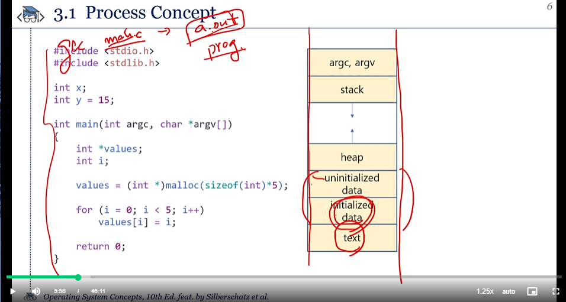
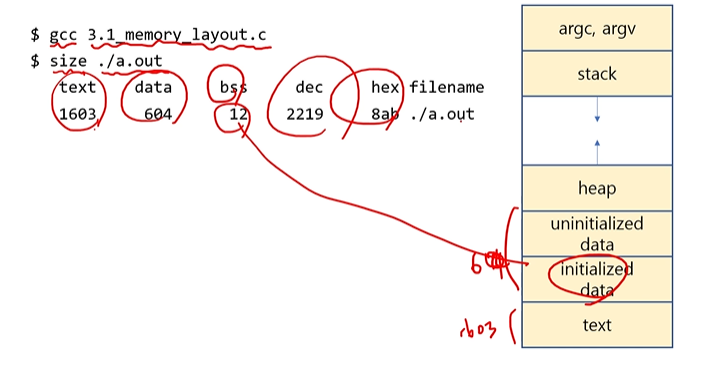
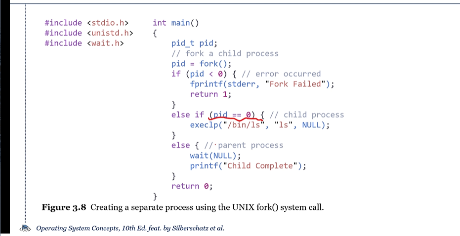

실습 1.

gcc -> a.out 으로 실행파일만듬.

프로세서는 어디에 올라가는가? 모든 램에 올라가나?

큰 파일이면,, 그 전체가?

프로세스 실행상태

PCB란?

PCB는 어디에샐겨?

프로그램 카운터란?

프로세스 당 PCB가 하나인건가?

at the same time, simultaneously,concurrently<-> parallel

wait queue -> ready Queue로감

