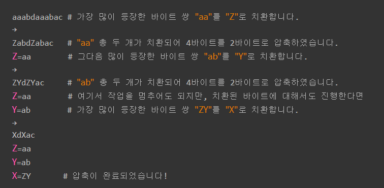

오늘은 아이펠 Going Deeper 노드 1번을 공부하고 공부한 내용을 포스팅해보았습니다.

------

###### 출처 

- AIFFEL LMS
- https://wikidocs.net/22592

---

# 1. 자연언어와 인공언어

자연언어란, 몇만년간 인류가 나름대로 발전시키고 통신 수단으로 사용하는 언어. 현재 약 200가지가 넘는 언어가 존재하며 이 중 40가지 정도가 글을 가지고 있다.

**문맥 의존 언어 이다.**

인공언어란, 컴퓨터 프로그래밍을 위하여 특별히 개발된 포트란, 파스칼 C와 같은 언어

**문맥자유 언어이다.**

자연어를 처리하는 것이 어려운 이유는 문맥 자유 언어가 아니기 때문입니다. 컴퓨터가 언어를 해석할 때, 문맥 자유 언어는 문법에 맞게 작성했다면, 글의 흐름을 파악할 필요가 없습니다. 문법에 맞게 파싱하기만 하면 되기 때문에 프로그래머가 작성한 대로 프로그램이 동작하게 됩니다.

# 2. 자연언어에서 발견할 수 있는 노이즈들

- 불완전한 문장으로 구성된 대화

  카톡과 같은 메신저를 사용할 때, 한 문장을 한번에 보내지 않고 여러번에 나눠 전송하는 형태입니다.

- 문장의 길이가 너무 길거나 짧은 경우

  대체로 `ㅋㅋㅋ` 혹은 `ㅎㅎ`, `ㅠㅠ`, `헐ㅋ`와 같은 리액션에 해당하는 경우가 많음.

- 채팅 데이터에서 문장 시간 간격이 너무 긴 경우

  - 서로의 말이 얽히며, 서로 각자의 할말만 하는 경우가 있음

    >  A: 베트맨2
    >
    > B: 보러가자
    >
    > A: 어제 봤는데 꿀잼
    >
    > B: 오늘 저녀.. 아니 ㅠ

  - 말의 텀이 매우 길 때

    > A: 혹시 돈좀 빌려 줄 수 있어?
    >
    > .... (한참 뒤)
    >
    > B: 아 미안 지금 봄. 지금도 필요해?

- 바람직하지 않은 문장의 사용

  욕설이나 비속어, 오타 비율이 높은 경우

위와 같은 언어는 UNFORMAL한 언어 데이터에서 자주 보이므로, FORMAL한 데이터에서도 자주 보이는 더 단순하고 근본적인 노이즈에 대해서도 알아보았습니다.

- 문장부호

  `Hi` 와 `Hi,`를 컴퓨터는 다르게 이해할 수 있습니다. 이같은 경우 문장부호 앞 뒤에 공백을 넣어 분리해줍니다.

  하지만, www.naver.com 이나 101,456 과 같은 데이터의 경우 공백을 넣으면 오히려 이상하게 처리를 해주는 꼴입니다. 

  위 같은 경우는 불가피한 손실로 취급하고 넘어가게 됩니다. 모든 규칙에 대해서 변환을 정의해줄 수는 없기 때문입니다. 게다가 보통 수행하고자 하는 목적에 큰 영향을 주지 못하기 때문에 오류가 있음에도 그냥 넘어가게 됩니다.

- 대소문자

  First와 first를 컴퓨터는 다르게 인식할 수 있으므로 lower()혹은 upper()메소드를 이용해 변경해줍니다.

- 특수문자

  영어에서는 나이를 ten-year-old와 같이 표현하는 경우가 있습니다. 이 같은 경우 특정 특수문자를 공백으로 변경하거나 없애는 처리를 추가해주며 보통 정규표현식으 사용하여 처리합니다.

# 3. 단어의 희소 표현과 분산 표현

## 희소 표현

해당 단어의 속성이 어느 그룹에 속하느냐를 벡터로 표현한 것.

 원-핫 인코딩을 통해서 얻은 원-핫 벡터는 표현하고자 하는 단어의 인덱스의 값만 1이고, 나머지 인덱스에는 전부 0으로 표현되는 벡터 표현 방법이었습니다. 이와 같이 벡터 또는 행렬의 값이 대부분이 0으로 표현되는 방법이 희소표현입니다.

ex ) 0번째 인덱스를 여자 = 1, 남자 -1로 표현한다면

> 남자 = [-1]
>
> 여자 = [1]
>
> 사과 = [0]
>
> 소년 = [-1]
>
> 바나나 = [0]

이런 속성들이 여러개가 된다면 결국 0000001000000000011001000000과 같은 표현이 될것입니다. 메모리 낭비가 심합니다.

## 분산표현

컴퓨터가 추상적으로 단어의 유사도를 계산하여 각각에 표현한 것.

분산 표현(distributed representation) 방법은 기본적으로 분포 가설(distributional hypothesis)이라는 가정 하에 만들어진 표현 방법

100개의 단어를 256차원의 속성으로 표현하고 싶다면 Embedding 레이어는 다음과 같이 정의됩니다.

`embedding_layer = tf.keras.layers.Embedding(input_dim=100, output_dim=256)`

# 4. 토큰화

단어에 대해 희소표현과 분산표현을 해주는 것은 단어 사전을 만들어 주기 위함입니다. 하지만 단어사전이 존재한다고 해도 컴퓨터는 엉뚱하게 해석하고 표현합니다. 그 이유는 컴퓨터가 문장을 단어단위로 정확히 끊어내지 못하기 때문입니다.

예를 들어,`나`와 `나는` 이란 단어가 있으면 `나`와 `나`,``-는`으로 단어를 끊어 해석해야 하는데  컴퓨터는 `나`와 `나는`을 전혀 연관성 없는 단어로 해석할 수 있습니다.

그래서 문장을 어떤 기준으로 쪼개주어야 하는데 쪼개진 단어들을 토큰이라고 합니다.

## 토큰화 기법 1. 공백 기반 토큰화

공백을 베이스로하여 문장을 나누어줍니다.  python에선 split함수를 많이 씀.

## 토큰화 기법 2. 형태소 기반 토큰화

대표적인 한국어 형태소 분석기 KoLNLPy를 사용해서 토큰화 해주기도 합니다. 

[KoNLPy: 파이썬 한국어 NLP - KoNLPy 0.4.3 documentation](https://konlpy-ko.readthedocs.io/ko/v0.4.3/)

다른 분석기를 사용하려면 다음 사이트를 참고하면 좋습니다

[한국어 형태소 분석기 성능 비교](https://iostream.tistory.com/144)

## 토큰화 기법 3. 사전에 없는 단어의 문제

토큰화 기법 1, 2에서 설명한 공백 기반, 형태소 기반은 모두 각각의 단어가 가지는 의미 단위로 토큰화 합니다. 이 기법의 경우는 데이터에  포함되는 모든 단어를 처리할 수 는 없기 때문에, 상위 N개의 단어만 사용하고 나머지는 특수한 토큰 `<unk>`토큰으로 치환합니다. 사진은 예시입니다.

이런 문장을 영문으로 번역할 땐 어려움이 있을 수 밖에 없습니다. 이 같은 문제를 해결하고자 하는 시도들이 있었고 그것이 Wordpiece Model입니다.

# 5. 토큰화 다른 방법

## 5-1. Byte Pair Encoding(BPE)

Subword(접두사/ 접미사 ex) Pre- )의 집합으로 보는 방법이 WPM(WordPiece Model)입니다. 이 모델을 알기전에 알아야 하는 것이  **Byte Pair Encoding(BPE)** 이므로, 이에 대해 간단히 설명하겠습니다.

데이터에서 가장 많이 등장하는 바이트 쌍(Byte Pair)을 새로운 단어로 치환하여 압축하는 작업을 반복하는 방식으로 동작합니다.

예시 ) 

이 방식을 사용하면, `lowest`라는 처음 등장해도, `low`와 `est`라는 단어 묶음이 이미 있다면, `lowest`를 `low`와 `est`의 조합으로, 즉 아는 단어로 처리할 수 있습니다.

즉 그렇기 대문에 아무리 큰 데이터도 원하는 크기로 OOV 문제없이 사전을 정의할 수 있습니다.

> OOV : Out of Vocabulary

Emdedding 레이어는 단어수 * Embedding 차원의 수 = weight 이기 때문에 단어의 개수 줄어드는 문제 = 메모리 절약

많은 데이터는 정확도로 이어지기 때문에 굉장히 큰 의미가 있습니다.

## 5-2. Wordpiece Model(WPM)

BPE의 단점은 나누는 그룹이 `i / a / o / n / b` 단위라면 이 단위들을 합치기는 어렵습니다. 이러한 단점을 극복하려 구글에서 만든 것이 WPM입니다. WPM은 BPE보다 두가지가 다릅니다.

1. 공백 복원을 위하여 단어 시작부분에 `_`를 추가합니다.
2. 빈도수 기반이 아니라 가능도`likelihood`를 증가시키는 방향으로 문자쌍을 합칩니다.

예를 들어 아까 예시는 `_i, _a, o, _n, b` 와 같이 토큰화가 진행됩니다.

이 경우, 모든 토큰을 합친 후, 언더바를 _를 공백으로 치환으로 마무리되어 간편합니다.

## 5-3. soynlp

한국어 자연어 처리를 위한 라이브러리로 한국어를 위한 토크나이저로 사용됩니다. 토크나이저 이외에도 단어 추출, 품사 판별, 전처리 기능도 제공합니다.

soynlp는 문장에서 처음 단어를 받아들일 때 단어의 경계를 비지도 학습을 통해 결정합니다. 비지도 학습을 통한 방법이라, 미등록 단어도 토큰화가 가능합니다. 여기서 사용된 비지도 학습은 통계적 방법이라 soynlp를 통계 기반 토크나이저로 분류하기도 합니다. 즉, `젤다의 전설`이 한 단어임을 인지하기 위하여 젤, 젤다, 젤다의, 젤다의 전, 젤다의 전설 각각 다음 글자의 확률을 계산하는 방식입니다.

# 6. 토큰에게 의미를 부여하기

토큰화된 단어조각들끼리 유사도 연산을 연산을 할 수 있게 의미를 부여하는 알고리즘을 소개합니다.

## 6-1. Word2Vec

`단어로 벡터를 만든다`는 뜻.

단어를 희소표현이 아닌 분산표현으로 나타낸 방법. 저차원에 단어의 이미를 여러 차원에다가 분산하여 표현합니다. 이러한 표현 방법을 사용하면, 단어 벡터간 유의미한 유사도를 계산할 수있는데 이를 위한 대표적인 학습 방법이 Word2Vec입니다.

word2Vec에는 두가지 학습 방식이 있습니다.

- CBOW Continuous Bag of words

  주변에 있는 단어들을 입력으로 중간에 있는 단어들을 예측하는 방법입니다. 

  

- Skip gram

  중간에 있는 단어들을 입력으로 주변 단어들을 예측하는 방법입니다.

### CBOW

주변에 있는 단어들을 입력으로 중간에 있는 단어들을 예측하는 방법입니다. 

### Skip gram

중간에 있는 단어들을 입력으로 주변 단어들을 예측하는 방법입니다.

## 6-2. FastText

## ELMo - the 1st Contextualized Word Embedding

