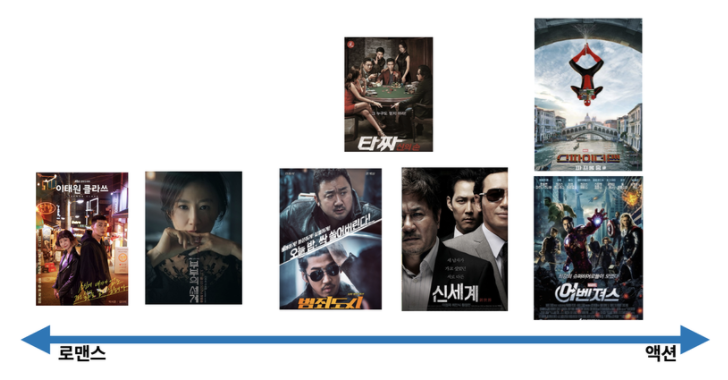
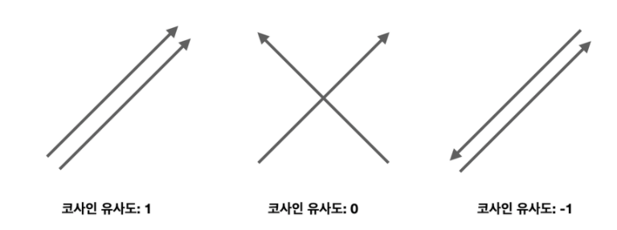
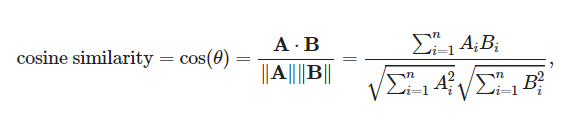
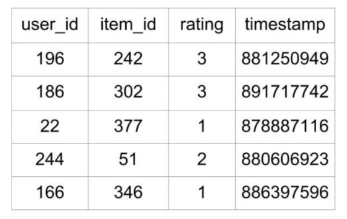
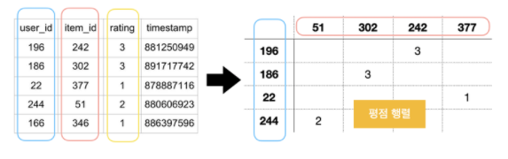
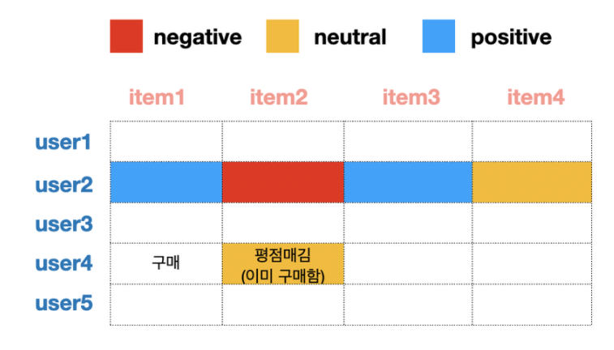
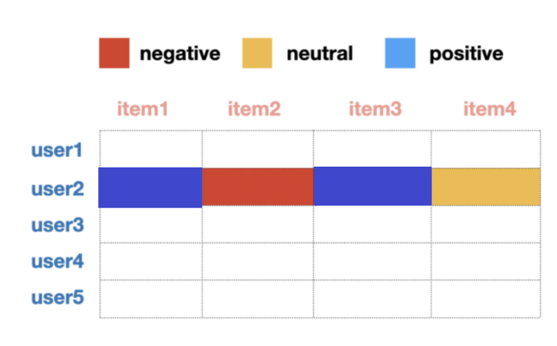
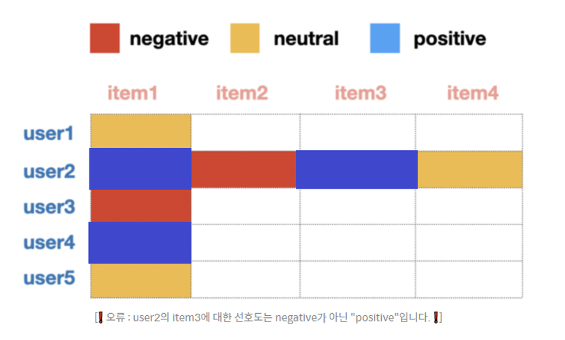
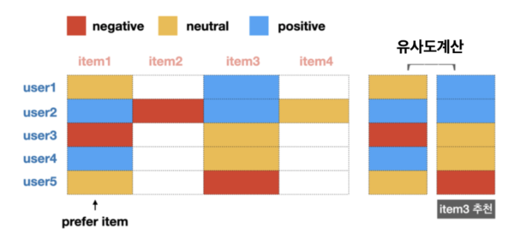
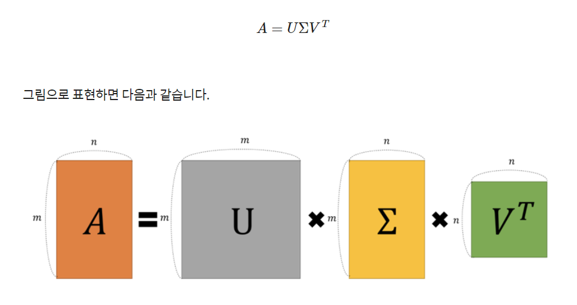

오늘은 아이펠 29번 fundamental 노드를 읽고 공부한 것을 작성해 보았습니다.


###### 목차

- 추천시스템이란?
- 유사도 계산
- 추천 시스템 종류
  - 콘텐츠 기반 필터링
  - 협업 필터링
    - 사용자 기반
    - 아이템 기반
    - 잠재요인 협업 필터링
  - 실제 추천 시스템


# 1. 추천 시스템이란?

> 사용자와 관련한 아이템을 추천해주는 것

이라고 한마디로 정의할 수 있습니다.


영화 추천 시스템을 예로 설명해보겠습니다.

실제 추천 시스템에서는 영화를 아래 사진처럼 좌표평면에 표현합니다.

수식을 이용해 정교하게 그리지만, 대략적으로 그리면 다음과 같습니다.




이렇게 놓고 보면 거리가 가까운 영화들은 장르가 비슷하다고 생각할 수 있으며, 사용자의 선호도가 어디에 위치하느냐에 따라 사용자에게 맞는 영화를 추천해 줄 수 있습니다.


이러한 추천은 사용자가 이용한 콘텐츠를 기반으로 추천해 주는 방식입니다. 하지만 만약 뉴비 사용자가 나타났다면 어떻게 추천을 해줄까요?


보통은 취향에 대한 정보를 받도록 설문조사가 배치되어있지만 전부 다 스킵하고 정말 인적사항만 아는 사용자의 경우가 있습니다. 이 경우, 뉴비 사용자의 인적사항과 기존 회원들의 인적사항을 분석하여 유사도를 측정하고, 뉴비 사용자에게 유사한 인적사항을 가진 사용자의 선호를 추천해주게 됩니다.


간단한 추천 로직이며, 이를 통해 두가지를 꼭 기억해야 합니다.

1. 범주형 데이터를 다룬다.

   이산적, 혹은 범주형이라고 합니다. 액션 / 로맨스 / 호러 등 카테고리가 나뉜 형태의 데이터입니다.

2. (숫자 벡터로 변환한 후) 유사도를 계산한다.

   범주형 데이터를 좌표에 나타내기 위하여 숫자로 이루어진 벡터로 변환합니다.(numerical vector) 그리고 그 거리를 계산해 유사도를 측정합니다.


# 2. 코사인 유사도

가장 유명한 유사도를 계산하는 방법입니다. 코사인 유사도는 두 벡터간의 코사인값을 계산하여 유사도를 측정하게됩니다.


코사인 유사도는 두 벡터가 방향이 이루는 각도에 코사인을 취해 구합니다.



위 그림은 두 벡터가 이루는 각도에 따른 유사도입니다. 1에 가까울 수록 유사도가 높다고 할 수 있습니다. 수식은 다음과 같습니다.




### numpy를 이용한 코사인 유사도

``` python
from numpy import dot
from numpy.linalg import norm
def cos_sim(A, B):
	return dot(A, B)/(norm(A)*norm(B))
```


### 사이킷 런을 활용한 코사인 유사도

```python
from sklearn.metrics.pairwise import cosine_similarity
t1 = np.array([[1, 1, 1]])
t2 = np.array([[2, 0, 1]])
cosine_similarity(t1,t2)
```


### 다른 방법의 유사도 측정방법

유클리드 거리 / 자카드 유사도 / 피어슨 상관계수 등의 방법이 있습니다.


# 3. 추천 시스템의 종류

- 콘텐츠 기반 필터링 (Content Based Filtering)

- 협업 기반 필터링 (Collaborative Filtering

  - 사용자 기반
  - 아이템 기반
  - 잠재요인 협업 필터링 (latent factor collaborative filtering) → 행렬 인수분해(matrix factorization)

- DeepLearning 적용

- Hybrid방식

  여러 방법을 결합한 방식


## 3-1. 콘텐츠 기반 필터링 방식

콘텐츠 기반은 오직 콘텐츠의 내용만을 비교해 추천하는 방식입니다.

아까 예를 들었던 영화로 말하자면, 사람들이 영화를 볼때 고려하는 점은 다음과 같습니다. 장르, 배우, 감독 등의 정보. 이러한 요소들을 영화의 **특성(Feature)**이라고 하고 이 특성을 바탕으로 콘텐츠의 유사도를 측정하게 됩니다.


**해당 예제는 CODE HEROKU의 ['Building a Movie Recemmendation Engine in Python using Scikit-Learn'](http://www.codeheroku.com/post.html?name=Building a Movie Recommendation Engine in Python using Scikit-Learn) 을 바탕으로 제작되었습니다.**


> 전체코드는 깃허브를 참고하시고, 블로그에는 새로 배운 것 위주로 작성하였습니다.


```python
import pandas as pd
import numpy as np
from sklearn.feature_extraction.text import CountVectorizer
from sklearn.metrics.pairwise import cosine_similarity
```


- os.getcwd() : 현재 파일이 실행되고 있는 working directory 출력

- scikit-learn.CountVectorize() : 단순하게 등장 횟수를 세어 숫자 벡터로 만들어줌.

  - out : CSR(Compressed Sparse Row) Matrix 

    CSR Matrix란?

    Sparse한 matrix에서 0이 아닌 데이터로 채워지는 데이터 값과 좌표 정보로만으로 구성하여 메모리 사용량을 최소화하고 Sparse한 matrix와 동일한 행렬을 표현할 수 있도록 하는 데이터 구조

- CountVectorize().fit_transform(pandas.dataframe)

  -  데이터에 맞춘 다음 변환합니다.

- cosine_similarity() : 코사인 유사도를 구하는 메소드

  - in : CSR Matrix


## 3-2. 협업 필터링 방식

과거의 사용자 행동 양식(User Behavior) 데이터를 기반으로 추천하는 방식으로, 잠재요인 기법을 활용하여 행동 양식을 데이터로 나타냄


### 기본원리



다음과 같은 테이블이 있다고 생각해봅시다. timestamp는 사용자가 평점을 매긴 시간입니다. 위 데이터를 사용자와 아이템간의 interaction matrix로 변환해봅시다. 그리고 해당 행렬의 데이터로 평점을 넣으면 아래와 같은 형식이 됩니다. 이를 평점행렬이라고 부르기도 합니다.



이러한 행렬은 굉장히 희소(sparse)한 행렬이 됩니다.


평점 행렬로 변환 후, 평점 행렬의 유사도를 계산하여 추천하는 방식 : 사용자기반, 아이템 기반 방식

평점행렬을 분해하여 더 많은 정보를 고려하는 방식 : 잠재요인 필터링

정리하자면 다음과 같습니다.

- 협업 필터링의 종류
  - 사용자 기반
    - 유사도 계산방식
  - 아이템 기반
    - 유사도 계산방식
  - 잠재요인 기반
    - 행렬인수분해 방식


### 사용자기반

> 당신과 비슷한 고객들이 다음 상품을 구매했습니다.

위 글을 시스템으로 만든 것이 사용자 기반 추천시스템입니다.



user 4가 아이템 1을 구매하고, user 4와 가장 유사한 user 2는 아이템 1-4까지 위와 같은 평점을 남겼다고 합시다. 이 경우, user2가 선호한 제품인 item 3을 4에게 추천해주는 방식입니다.


### 아이템기반

> 이 상품을 선택한 다른 고객들은 다음 상품을 구매했습니다.

위 말을 시스템으로 만든 것이 아이템 기반 추천 시스템입니다. 일반적으로 사용자 기반보다는 아이템 기반 방식이 정확도가 높다고 합니다.



user2가 위와 같은 선호도를 가졌다할 때, 아이템 1의 선호도가 가장 높습니다.

그리고 아이템 1의 선호도는 다음과 같습니다.



아이템 2을 좋아한 사람은 user4이므로 user4에게 user2가 좋아한 상품인 3을 추천해줍니다.





### 잠재요인 협업 필터링 기반

평점행렬을 행렬 인수분해(matrix factorization)를 통해 잠재요인(latent factor)을 분석


행렬 인수분해 종류

- SVD(Singular Vector Decomposition)
- ALS(Alternating Least Squares)
- NMF(Non-Negative Factorization)


#### SVD Singular Vector Decomposition

가장 많이 사용됨, 우리말로는 특잇값 분해

M*N 형태의 행렬 A를 다음과 같은 형태로 분해하여 나타냄




------

###### 출처

- AIFFEL LMS 

  문제시 연락 부탁드립니다. :)

- 5
